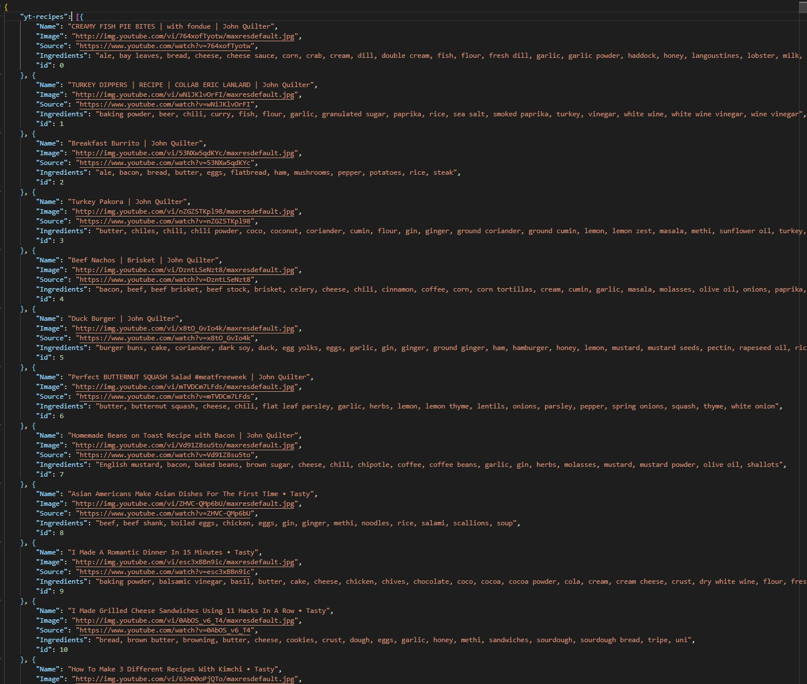

# Recipes-API
An API with a large collection of recipes collected from youtube videos. The body of each JSON object includes the video's title, image url, list of ingredients as a string, video url, and unique id. 

- [API URL Here](https://recipes-database-api.herokuapp.com/yt-recipes)

- [Here's the script I made to collect this data](https://github.com/kenny101/Youtube-Recipes-Dataset-with-Ingredients)

# Example of JSON Data: 

